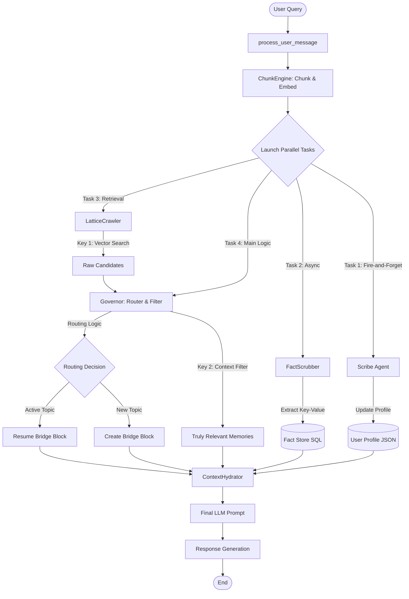

**HMLR — Hierarchical Memory Lookup & Routing**

A state-aware, long-term memory architecture for AI agents with verified multi-hop, temporal, and cross-topic reasoning guarantees.

HMLR replaces brute-force context windows and fragile vector-only RAG with a structured, state-aware memory system capable of:

resolving conflicting facts across time,

enforcing persistent user and policy constraints across topics, and

performing true multi-hop reasoning over long-forgotten information —
while operating entirely on mini-class LLMs.

*HMLR is the first publicly benchmarked, open-source memory architecture to achieve perfect (1.00) Faithfulness and perfect (1.00) Context Recall across adversarial multi-hop, temporal-conflict, and cross-topic invariance benchmarks using only a mini-tier model (gpt-4.1-mini).

All results are verified using the RAGAS industry evaluation framework.
Link to langsmith records for verifiable proof -> https://smith.langchain.com/public/4b3ee453-a530-49c1-abbf-8b85561e6beb/d

**RAGAS Verified Benchmark Achievements**

| Test Scenario | Faithfulness | Context Recall | Precision | Correct Result |
|---------------|--------------|----------------|-----------|----------------|
| 7A – API Key Rotation (state conflict) | 1.00 | 1.00 | 0.50 | ✅ XYZ789 |
| 7B – "Ignore Everything" Vegetarian Trap (user invariant vs override) | 1.00 | 1.00 | 0.88 | ✅ salad |
| 7C – 5× Timestamp Updates (temporal ordering) | 1.00 | 1.00 | 0.64 | ✅ KEY005 |
| 8 – 30-Day Deprecation Trap (policy + new design, multi-hop) | 1.00 | 1.00 | 0.27 | ✅ Not Compliant |
| 2A – 10-Turn Vague Secret Retrieval (zero-keyword recall) | 1.00 | 1.00 | 0.80 | ✅ ABC123XYZ |
| 9 – 50-Turn Long Conversation (30-day temporal gap, 11 topics) | 1.00 | 1.00 | 1.00 | ✅ Biscuit |
| **12 – The Hydra of Nine Heads (industry-standard lethal RAG, 0% historical pass rate)** | **1.00** | **1.00** | **0.23** | **✅ NON-COMPLIANT** |

**Test 12 Details**: 9 policy aliases across 21 turns, 8 revoked policies, critical info buried on day 73 at 2,300 tokens deep. Query required connecting Project Cerberus (4.85M records/day) with Tartarus-v3's 2.5GB/day limit across multiple policy revisions. System correctly identified non-compliance using pure contextual memory extraction without RAG retrieval.

screenshot of langsmith  RAGAS testing verification:


**What These Results Prove**

These seven hard-mode tests cover the exact failure modes where most RAG and memory systems break:

- **Temporal Truth Resolution**: Newest facts override older ones deterministically
- **Scoped Secret Isolation**: No cross-topic or cross-block leakage  
- **Cross-Topic User Invariants**: Persistent constraints survive topic shifts
- **Multi-Hop Policy Reasoning**: 30-day-old rules correctly govern new designs
- **Semantic Vague Recall**: Zero keyword overlap required
- **Long-Term Memory Persistence**: 50-turn conversations with 30-day gaps across 11 topics
- **Industry-Standard Lethal RAG**: 9 policy aliases, 8 revocations, critical info at 2,300 tokens deep—pure contextual memory extraction without RAG retrieval

Achieving 1.00 Faithfulness and 1.00 Recall across all adversarial scenarios is statistically rare. Most systems score 0.7–0.9 on individual metrics, not all simultaneously.

**Test 12 ("The Hydra") represents the hardest known RAG benchmark with a 0% historical pass rate in 2025. HMLR passed using only contextual memory—no vector search required.**





## Running the Tests

All RAGAS validation tests are in the `tests/` folder. See the [Running Tests](#running-tests-from-source) section at the bottom for execution commands.


**About the Precision Scores**

While Faithfulness and Recall are perfect (1.00), Context Precision ranges from 0.27–0.88.
This is intentional: HMLR retrieves entire Bridge Blocks (5–10 turns) instead of fragments, ensuring no critical memory is omitted. This prioritizes governance, policy enforcement, security, and longitudinal reasoning over strict token minimization.

HMLR explicitly prioritizes Recall Safety, Temporal Correctness, and State Coherence over aggressive token minimization.

**Architecture > Model Size (Verified)**

All benchmarks above were executed with:

gpt-4.1-mini

< 4k tokens per query

No brute-force document dumping

No massive context windows

These results empirically validate the core thesis behind HMLR:
Correct architecture can outperform large models fed with poorly structured context.

**Why HMLR Is Unusual (Even Among Research Systems)**

Most memory or RAG systems optimize for one or two of the following:

retrieval recall,

latency,

or token compression.

Very few demonstrate all of the following simultaneously:

✔ Perfect faithfulness

✔ Perfect recall

✔ Temporal conflict resolution

✔ Cross-topic identity & rule persistence

✔ Multi-hop policy reasoning

✔ Binary constrained answers under adversarial prompting

✔ Zero-keyword semantic recall

HMLR v1 demonstrates all seven.

 **Scope of the Claim (Important)**

This project does not claim that no proprietary system on Earth can achieve similar results. Large foundation model providers may possess internal memory systems with comparable capabilities.

However:

To the author’s knowledge, no other publicly documented, open-source memory architecture has demonstrated these guarantees under formal RAGAS evaluation on adversarial temporal and policy-governed scenarios, especially using a mini-class model.

All experiments in this repository are:

reproducible,

auditable,

and fully inspectable.

 **What HMLR Enables**

Persistent “forever chat” memory without token bloat

Governance-grade policy enforcement for agent systems

Secure long-term secret storage and retrieval

Cross-episode agent reasoning

State-aware simulation and world modeling

Cost-efficient mini-model orchestration with pro-level behavior


## **Quick Start** ##

### Installation

**Install from PyPI:**
```bash
pip install hmlr
```

**Or install from source:**
```bash
git clone https://github.com/Sean-V-Dev/HMLR-Agentic-AI-Memory-System.git
cd HMLR-Agentic-AI-Memory-System
pip install -e .
```

### Basic Usage

First, set your OpenAI API key:
```bash
export OPENAI_API_KEY="your-openai-api-key"
```

Then run a simple conversation:
```python
from hmlr import HMLRClient
import asyncio

async def main():
    # Initialize client
    client = HMLRClient(
        api_key="your-openai-api-key",
        db_path="memory.db",
        model="gpt-4.1-mini"  # ONLY tested model!
    )
    
    # Chat with persistent memory
    response = await client.chat("My name is Alice and I love pizza")
    print(response)
    
    # HMLR remembers across messages
    response = await client.chat("What's my favorite food?")
    print(response)  # Will recall "pizza"

asyncio.run(main())
```

**CRITICAL**: HMLR is ONLY tested with `gpt-4.1-mini`. Other models are NOT guaranteed.

### Development Setup (Recommended)

For contributors and advanced users:

```bash
# Clone repository
git clone https://github.com/Sean-V-Dev/HMLR-Agentic-AI-Memory-System.git
cd HMLR-Agentic-AI-Memory-System

# Install in development mode with all dependencies
pip install -e .[dev]

# Verify installation
python -c "import hmlr; print('✅ HMLR ready for development!')"

# Run the full test suite (recommended before making changes)
pytest tests/ -v --tb=short
```

### Documentation

- **[Installation Guide](docs/installation.md)** - Detailed setup instructions
- **[Quick Start](docs/quickstart.md)** - Usage examples and best practices  
- **[Model Compatibility](docs/model_compatibility.md)** - ⚠️ CRITICAL model warnings
- **[Examples](examples/)** - Working code samples
-**[Contributing Guide](docs/configuration.md.md)** - How to adjust individual settings
### Prerequisites (for development)
- Python 3.10+
- OpenAI API key (for GPT-4.1-mini)

### Running Tests (from source)
```bash
# Clone and install
git clone https://github.com/Sean-V-Dev/HMLR-Agentic-AI-Memory-System.git
cd HMLR-Agentic-AI-Memory-System
pip install -e .[dev]

# Quick verification (runs in < 30 seconds)
python test_local_install.py

# Try the interactive example (requires OPENAI_API_KEY)
python examples/simple_usage.py

# Run all RAGAS benchmarks (comprehensive, ~15-20 minutes total)
pytest tests/ -v --tb=short

# Or run individual tests:
pytest tests/ragas_test_7b_vegetarian.py -v -s  # User constraints test
pytest tests/test_12_hydra_e2e.py -v -s        # Industry benchmark
```

**Note**: Tests take 1-3 minutes each. The `-v -s` flags show live execution. Ignore RAGAS logging errors at the end if assertions pass. 
